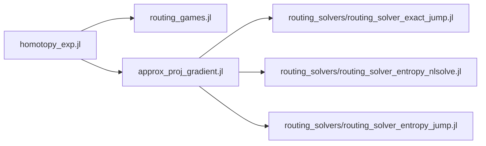

# inverse_routing
> Multiple (approximate) Nash forward solvers for routing games, and an approximate projected gradient algorithm as the inverse solver.


## Installation

#### Dependencies
  - for solvers: LinearAlgebra, JuMP, Ipopt, NLsolve
  - for routing game instances: BlockDiagonals, Graphs, GraphRecipes
  - for saving and plotting: JLD2, Plots, GraphPlot, ColorSchemes, MAT
  - for command line args: ArgParse

#### Code structure


  - Routing games
      > pa
      - `routing_games.jl`: pre-defined routing games
  - Forward solvers (in directory `routing_solvers/...`)
      > pa + (b, C) -> (x, v)
      - `routing_solver_exact_jump.jl`: Exact Nash solver, implemented using JuMP with Ipopt solver
      - `routing_solver_entropy_nlsolve.jl`: Entropy-regularized approximate Nash solver, implemented using NLsolve
      - `routing_solver_entropy_jump.jl`: Entropy-regularized approximate Nash solver, implemented using JuMP with Ipopt solver
  - Backward algorithm
      > pa + (x, v) -> (b, C)
      - `approx_proj_gradient.jl`: approximated projected gradient descent algorithm that computes costs (b, C) using approximate solvers, and evaluate its performance using the exact solver
  - homotopy experiment
      - `homotopy_exp.jl`: homotopy experiments using backward algorithm on a given routing game instance
    
## Usage example

Instantiate the routing game instance, e.g., `grid_graph3_4_players_reduced()`, and set values in the `λ_list`in last few lines of `homotopy_exp.jl`, then call experiment by
```
julia homotopy_exp.jl
```

You can set these command line arguments, with default values below:
```
  "rho"            => 0.5
  "lambda"         => 0.01
  "alpha"          => 0.005
  "epsilon"        => 0.001
  "max_iter"       => 10
  "plot"           => true
  "forward_solver" => "nlsolve"
  "mat"            => false
  "game"           => "grid_graph3_2_players_reduced"
```
To run experiment on a different routing game (right now only supports the two define games in `routing_games.jl`), do the following,
```
julia homotopy_exp.jl --game "grid_graph5_4_players_reduced"
```
If you want to switch to the jump version of the forward solver, you can do
```
julia homotopy_exp.jl --forward_solver jump
```
If you want to disable plotting, do
```
julia homotopy_exp.jl --plot false
```
If you want to generate output in matlab format (.mat), do
```
julia homotopy_exp.jl --mat true
```

## Future

You can write your own routing game with required inputs:
- game_name
- g, directed graph
- p, number of players, and for each player
    - source-sink indices
    - desired route edge indices
    
Then conduct homotopy experiment on this routing game by instantiate with this game_name.
